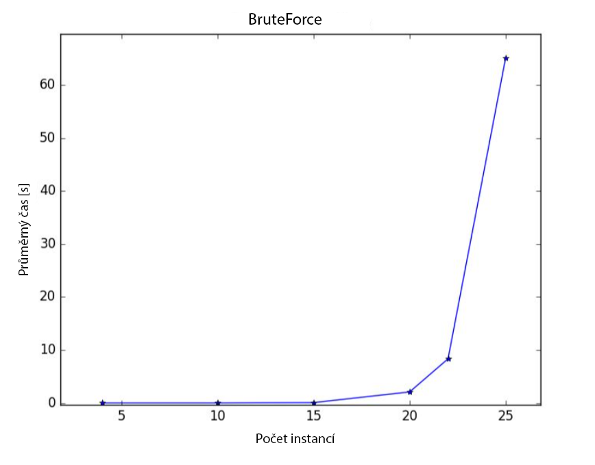
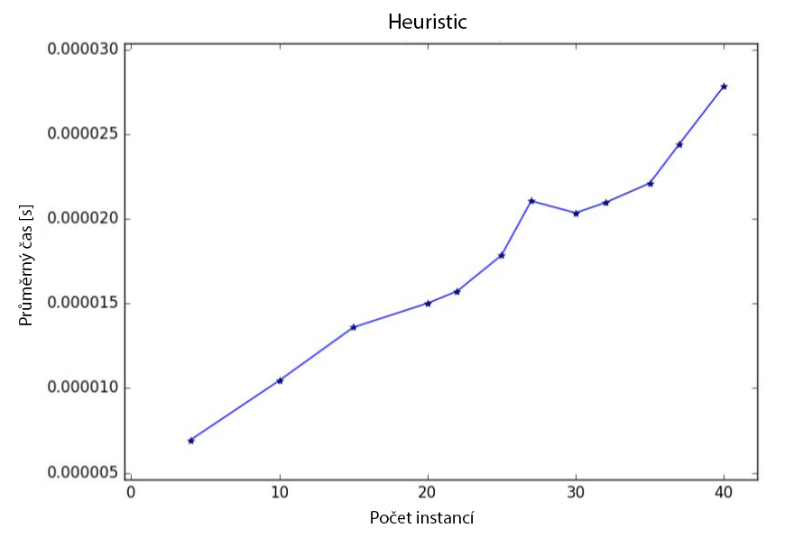

# KnapsackSwift - 1st report

- Knapsack problem solver written in Swift 4.0
- MI-PAA semestral project @ CTU FIT university
- Below is the report for the 1st part (in Czech language)
- All measurements was made on MacBook Pro (13-inch Mid 2017)   
(CPU: Intel Core i5-7360U, RAM: 16 GB, OS: macOS High Sierra)
- Author: Petr Chmelar
- Date: 25/10/2017

## Úloha
- Cílem úlohy je implementace a analýza řešení problému batohu hrubou silou a heuristikou.

## Varianty řešení
- Při řešení hrubou silou je nutné vyzkoušet všechny možnosti naplnění batohu.   
- Za heuristiku je možné zvolit například poměr ceny a váhy.

## Popis řešení
- Instance problému je reprezentována třídou ProblemInstance. Každá instance má definované metody solveBruteForce a solveHeuristic, které vyřeší instanci zvolenou metodou.   
- Metoda solveBruteForce je implementovaná rekurzivně a má tři vstupní parametry: velikost problému, aktuální váhu batohu a aktuální hodnotu batohu. Rekurze se vždy větví na další dva případy, dle toho zda přidáme nebo nepřidáme aktuální předmět do batohu.
- Metoda solveHeuristic zohledňuje poměr ceny a váhy jednotlivých předmětů. Iterativně prochází předměty, které jsou seřazené sestupně dle poměru ceny a váhy. Pokud je součet aktuální hmotnosti batohu a váhy aktuálního předmětu menší nebo rovný kapacitě batohu, tak objekt přidá do batohu.

## Naměřené výsledky
| Počet instancí | BruteForce Průměrný čas [s] | Heuristic Průměrný čas [s] | Heuristic Průměrná chyba [0-1] | Heuristic Maximální chyba [0-1] |
|----------------|-----------------------------|----------------------------|--------------------------------|---------------------------------|
| 4              | 4.72E-05                    | 6.93E-06                   | 0.03338293757                  | 0.4377880184                    |
| 10             | 0.002212371826              | 1.04E-05                   | 0.0122319864                   | 0.09090909091                   |
| 15             | 0.0642175436                | 1.36E-05                   | 0.006162124284                 | 0.08542713568                   |
| 20             | 2.078239183                 | 1.50E-05                   | 0.007978964927                 | 0.0843373494                    |
| 22             | 8.327893114                 | 1.57E-05                   | 0.005932372633                 | 0.07228915663                   |
| 25             | 65.13239241                 | 1.78E-05                   | 0.005465821708                 | 0.03678929766                   |
| 27             | NaN                         | 2.11E-05                   | NaN                            | NaN                             |
| 30             | NaN                         | 2.03E-05                   | NaN                            | NaN                             |
| 32             | NaN                         | 2.10E-05                   | NaN                            | NaN                             |
| 35             | NaN                         | 2.21E-05                   | NaN                            | NaN                             |
| 37             | NaN                         | 2.44E-05                   | NaN                            | NaN                             |
| 40             | NaN                         | 2.78E-05                   | NaN                            | NaN                             |

## Grafy

## Závěr
- Výpočetní čas hrubou silou roste exponenciálně, protože je nutné projít 2^n kombinací, kde n je počet předmětů.
- Použitím heuristiky je výpočetní čas výrazně nižší a roste zdánlivě lineárně. Ve skutečnosti je ale složitost n\*log(n), protože pole předmětů je potřeba seřadit dle poměru ceny a váhy.
