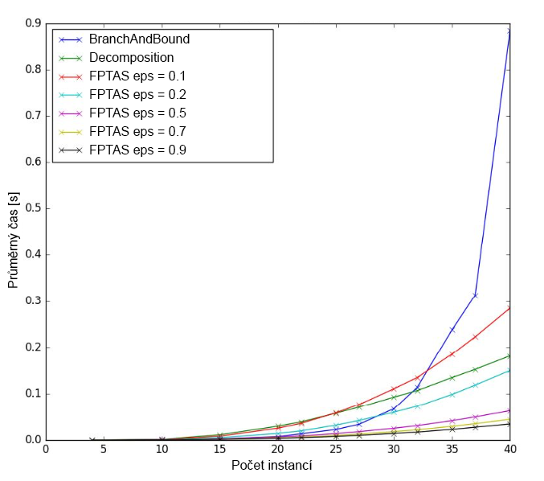
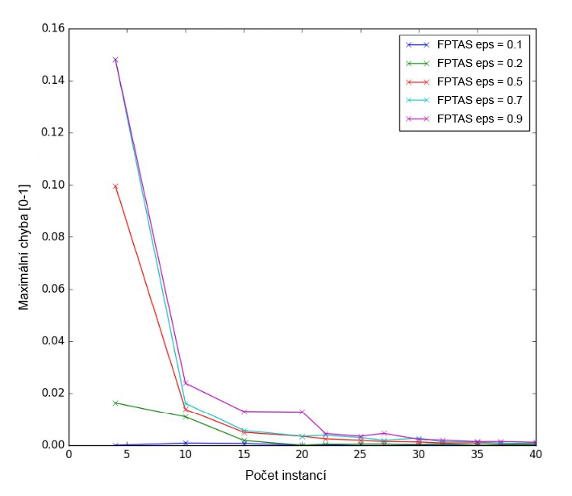

# KnapsackSwift - 2nd report

- Knapsack problem solver written in Swift 4.0
- MI-PAA semestral project @ CTU FIT university
- Below is the report for the 2nd part (in Czech language)
- All measurements was made on MacBook Pro (13-inch Mid 2017)   
(CPU: Intel Core i5-7360U, RAM: 16 GB, OS: macOS High Sierra)
- Author: Petr Chmelar
- Date: 11/11/2017

## Úloha
- Cílem úlohy je implementace a analýza řešení problému batohu metodami větví a hranic, dynamickým programováním a aproximativním algoritmem FPTAS.

## Popis řešení

### Metoda větví a hranic  
- Metoda solveBranchAndBound vychází z rekurzivní metody solveBruteForce (viz report1). Má navíc čtvrtý vstupní parametr reprezentující nejlepší zatím dosažené řešení. Při větvení rekurze je pak vždy provedena kontrola, zda u nově vytvářené větve je potenciál pro nalezení lepšího řešení než nejlepšího zatím dosaženého. V negativním případě je tato větěv odříznuta. Metoda větví a hranic výpočet často značně urychlí, ale asymptotická složitost zůstavá 2^n.

### Metoda dynamického programování
- Tato metoda může využívat dekompozici problému podle ceny, nebo podle váhy. Vzhledem k následné implementaci FPTAS algoritmu jsem zvolil dekompozici podle ceny. Řešení podproblémů jsou v tomto případě uložené v tabulce o rozměrech n (počet věcí) x maxValue (suma cen všech věcí) - asymptotická složitost je n \* maxValue. 
- Algoritmus začíná ve sloupci 0 a postupně plní tabulku doprava dle následujících pravidel:
```swift
table[0][0] = 0
table[0][j] = Int.max ... pro všechna j > 0
table[i][j] = min(table[i-1][j], table[i-1][j-items[i-1].value] + items[i-1].weight) ... pro všechna i > 0
```
- Výsledné řešení poté nalezneme v posledním sloupci, jeho hodnota je menší než maxWeight a má maximální index v rámci sloupce.

### Aproximativní algoritmus FPTAS
- Zde využijeme metody dynamického programování nad zjednodušeným modelem. Zjednodušení dosáhneme vydělením cen konstantou, čímž se sníží hodnota maxValue (suma cen všech věcí) a tedy i složitost metody dynamického programování.
- Pro zvolenou maximální relativní chybu epsilon má konstanta hodnotu:
```swift
coeff = (eps * maxValue) / n
```
- Ceny modifikujeme tak, že je vydělíme získanou konstantou:
```swift
item.value = floor(item.value / coeff)
```
- Pro spočítání relativní chyby algoritmu jsou potom použité původní ceny řešení, které vzniklo z upravených cen.

## Naměřené výsledky

### Průměrný čas výpočtu [s]
| Počet instancí | BruteForce     | BranchAndBound | Decomposition  |
|----------------|----------------|----------------|----------------|
| 4              | 4.72E-05       | 4.52E-05       | 4.70E-05       |
| 10             | 0.002212371826 | 0.000564956665 | 0.001222410202 |
| 15             | 0.0642175436   | 0.002381997108 | 0.0112460804   |
| 20             | 2.078239183    | 0.007297010422 | 0.02949497223  |
| 22             | 8.327893114    | 0.01334373951  | 0.03868565559  |
| 25             | 65.13239241    | 0.02243446827  | 0.0573835659   |
| 27             | NaN            | 0.03353640556  | 0.07064874649  |
| 30             | NaN            | 0.0672105217   | 0.09264957905  |
| 32             | NaN            | 0.1134650469   | 0.1066818571   |
| 35             | NaN            | 0.2375982618   | 0.1345773458   |
| 37             | NaN            | 0.3127718019   | 0.1523378181   |
| 40             | NaN            | 0.8838491535   | 0.1812687922   |

| Počet instancí | FPTAS eps = 0.1 | FPTAS eps = 0.2 | FPTAS eps = 0.5 | FPTAS eps = 0.7 | FPTAS eps = 0.9 |
|----------------|-----------------|-----------------|-----------------|-----------------|-----------------|
| 4              | 4.05E-05        | 3.84E-05        | 3.79E-05        | 3.59E-05        | 3.44E-05        |
| 10             | 0.001004443169  | 0.0008202505112 | 0.00054292202   | 0.000442738533  | 0.0003872442245 |
| 15             | 0.008152580261  | 0.004897398949  | 0.002348351479  | 0.001742391586  | 0.001400036812  |
| 20             | 0.02529704094   | 0.01414449215   | 0.006385917664  | 0.004600334167  | 0.003597226143  |
| 22             | 0.0354944849    | 0.01953785419   | 0.008720974922  | 0.006270194054  | 0.004920625687  |
| 25             | 0.05813314438   | 0.03174095154   | 0.0137139225    | 0.009780721664  | 0.007627558708  |
| 27             | 0.07652493954   | 0.04172838688   | 0.01788859367   | 0.01274762154   | 0.009964566231  |
| 30             | 0.1106373072    | 0.05957987785   | 0.02515998363   | 0.01795533657   | 0.01411275387   |
| 32             | 0.1346078348    | 0.0725420332    | 0.03064801216   | 0.02174154282   | 0.01695840359   |
| 35             | 0.1852054739    | 0.09846645832   | 0.04128169537   | 0.02922977924   | 0.0226640749    |
| 37             | 0.2228449392    | 0.1184925175    | 0.04941093922   | 0.03481067657   | 0.02721654415   |
| 40             | 0.2844247484    | 0.1498497629    | 0.06273522854   | 0.04417655945   | 0.03418153286   |

### FPTAS maximální chyba [0-1]
| Počet instancí | FPTAS eps = 0.1 | FPTAS eps = 0.2 | FPTAS eps = 0.5 | FPTAS eps = 0.7 | FPTAS eps = 0.9 |
|----------------|-----------------|-----------------|-----------------|-----------------|-----------------|
| 4              | 0               | 0.01630434783   | 0.09956709957   | 0.1481481481    | 0.1481481481    |
| 10             | 0.00083682008   | 0.01081081081   | 0.01376146789   | 0.01612903226   | 0.02375809935   |
| 15             | 0.00072411296   | 0.00183374083   | 0.0049170252    | 0.00565291124   | 0.01293588301   |
| 20             | 0               | 0               | 0.00342612419   | 0.00342612419   | 0.01276789786   |
| 22             | 0               | 0.00039047247   | 0.00241662639   | 0.00384245917   | 0.00445632798   |
| 25             | 0.00036900369   | 0.00039047247   | 0.00187546886   | 0.00292718624   | 0.00342679127   |
| 27             | 0.00039478878   | 0.00039478878   | 0.00142602495   | 0.00185185185   | 0.00450762829   |
| 30             | 0               | 0.00027593818   | 0.00124766063   | 0.00269814502   | 0.00222827432   |
| 32             | 0               | 0.00051934562   | 0.00086730268   | 0.00130480167   | 0.00196573996   |
| 35             | 0               | 0               | 0.00087591240   | 0.00116856558   | 0.00139372822   |
| 37             | 0               | 0.00028384899   | 0.00080407397   | 0.00083125519   | 0.00140845070   |
| 40             | 0               | 0.00021800741   | 0.00064377682   | 0.00064377682   | 0.00111632060   |

## Grafy



## Závěr
- Z grafu průměrných časů vypočtů je vidět, že pro větší instance je nejrychlejším přesným algoritmem dynamické programování.
- Maximální chyba algoritmu FPTAS je v praxi daleko menší, než teoretická maximální průměrná cena, přičemž výpočetní čas je pro větší epsilon násobně nižší než výpočetní čas dynamického programování.
