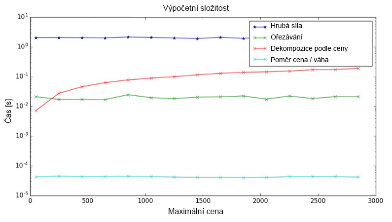
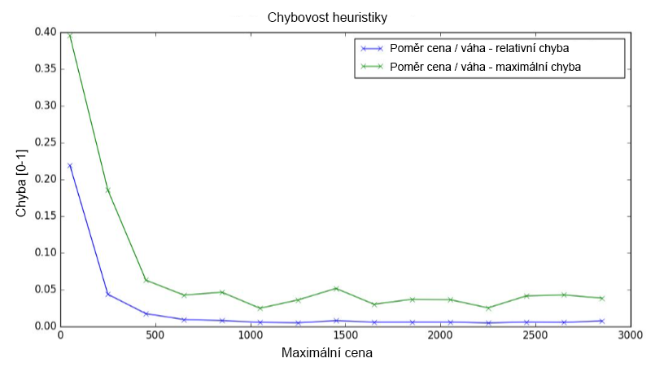
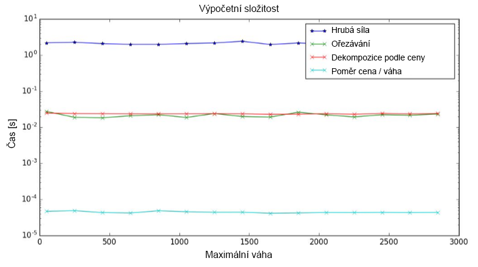
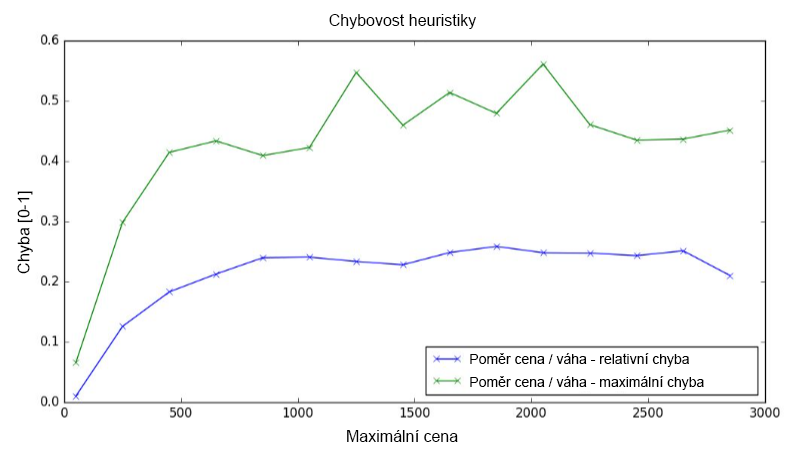
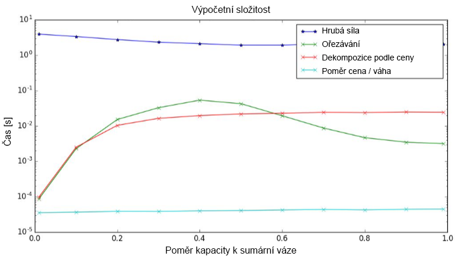
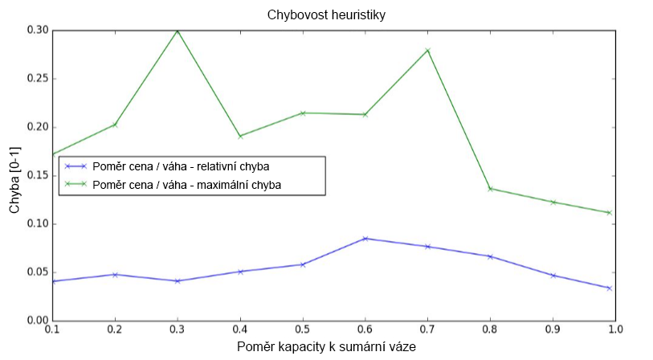
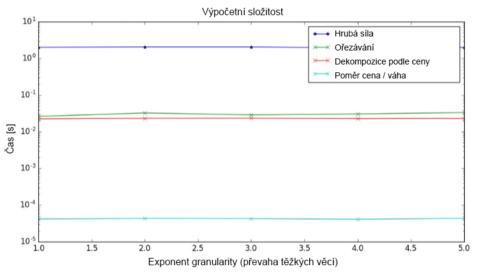
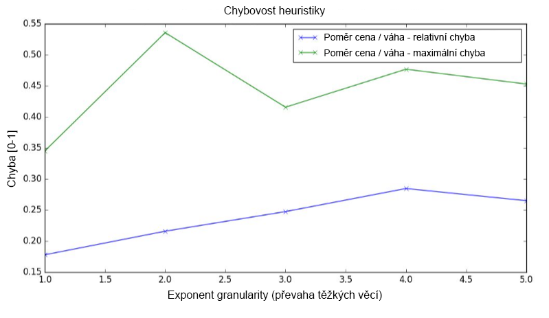
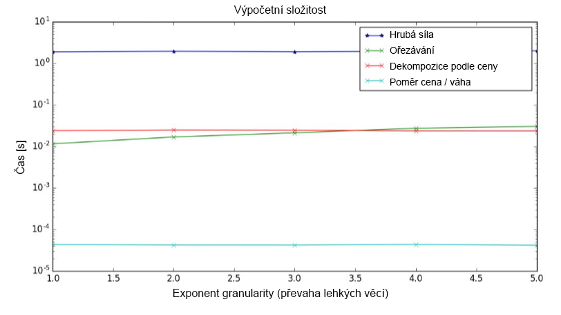
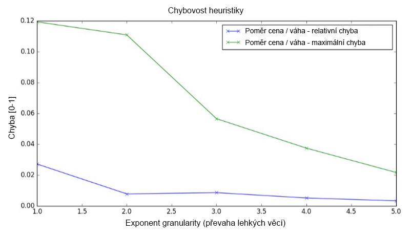

# KnapsackSwift - 3rd report

- Knapsack problem solver written in Swift 4.0
- MI-PAA semestral project @ CTU FIT university
- Below is the report for the 3rd part (in Czech language)
- All measurements was made on MacBook Pro (13-inch Mid 2017)   
(CPU: Intel Core i5-7360U, RAM: 16 GB, OS: macOS High Sierra)
- Author: Petr Chmelar
- Date: 30/10/2017

## Úloha
- Využijte generátor náhodných instancí a experimentálně ohodnoťte algoritmy z hlediska kvality řešení a výpočetní náročnosti.

## Popis řešení
- Prostřednictvím generátoru náhodných instancí jsem vygeneroval testovací datasety pro různé parametry. Při testování jednoho parametru byli ostatní parametry záměrně zafixované.
- Parametry jsem fixoval následovně, velikost instance n = 20, počet instancí N = 50, cena C = 200, váha W = 200, poměr kapacity k sumární váze m = 0.6, koeficient granularity k = 1 a převaha těžkých / lehkých věcí d = 0.
- Výpočetní náročnost jsem měřil pro všechny dříve implementované algoritmy, metodu hrubou silou, heuristiku poměr cena / váha, metodu ořezávání a metodu dekompozice podle ceny.
- Relativní a maximální průměrnou chybu jsem měřil pouze v případě heuristiky poměr cena / váha. Ostatní metody zaručují optimální řešení.
- Výpočetní složitost jsem ve všech případech měřil jako čas trvání algoritmu. Všechna měření byla prováděna na výše uvedeném počítači a použité datové struktury byly identické, proto se lze domnívat, že čas běhu reflektuje výpočetní složitost algoritmů.

## Grafy

### Cena
- Cena ovlivňuje výpočetní složitost pouze pro metodu dekompozice podle ceny, kde se zvyšující se cenou narůstá velikost tabulky.
- Chybovost heuristiky je vyšší při velmi nízké maximální ceně, jinak se chybovost drží na stabilně konstantní hodnotě.   

 

### Váha
- Váha nijak výrazně neovlivňuje výpočetní náročnost algoritmů.
- Chybovost heuristiky je zde opakem chybovosti způsobené cenou. Při velmi nízké maximální váze je nízká a postupně se ustálí na vyšších hodnotách.   

 

### Poměr kapacity k sumární váze
- Poměr kapacity k sumární váze ovlivňuje metodu ořezávání, kde při nízké hodnotě dochází k častému ořezávání shora a při vysoké hodnotě zdola. Nejhorších výsledků tedy metoda dosahuje při poměru okolo 0.5. Metoda dekompozice podle ceny trvá kratší dobu při nízkém poměru (rychle se naplní kapacita batohu).
- Chybovost není přiliš závislá na daném parametru.   

 

### Koeficient granularity
- Výpočetní složitost není granularitou nijak výrazně ovlivněna.
- Čím více těžkých věcí existuje, tím více chybovost mírně roste. A naopak, čím více lehkých věcí, tím více chybovost mírně klesá. Změny jsou ale pouze lineární, přičemž granularita se mění exponenciálně.   

 

 

## Závěr
- Výsledky měření ukazují, že metody řešení hrubou silou a heuristika poměr cena / váha jsou datově necitlivé. Na výpočetní složitost metod ořezávání a dekompozice podle ceny má vliv cena a poměr kapacity k sumární váze. 
- Chybovost metody heuristiky poměr cena / váha ovlivňuje nízká cena nebo nízká váha. Po zvýšení těchto parametrů se chyba stabilizuje. Chybovost dále mírně ovlivňuje také převaha těžkých / lehkých věcí.
