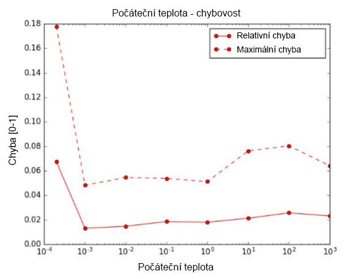
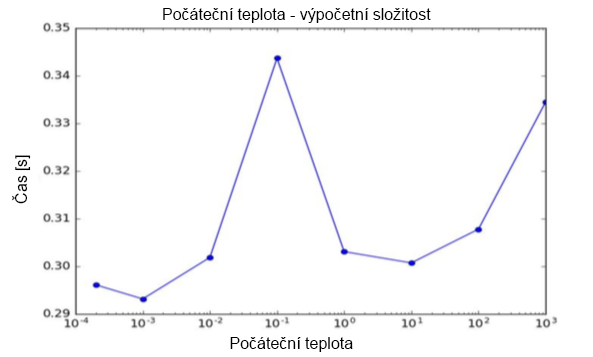
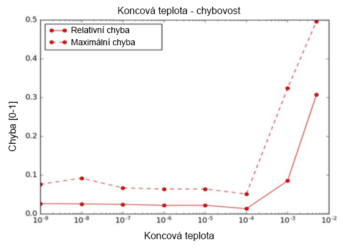
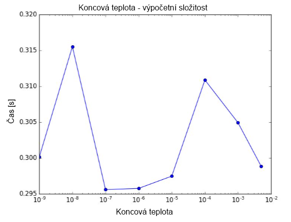
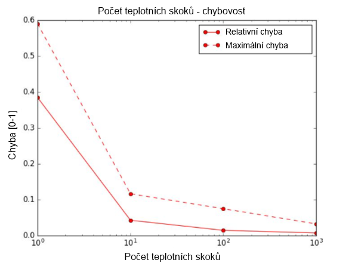
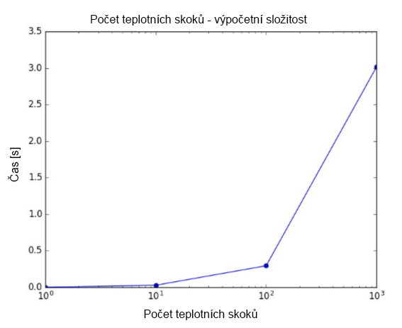
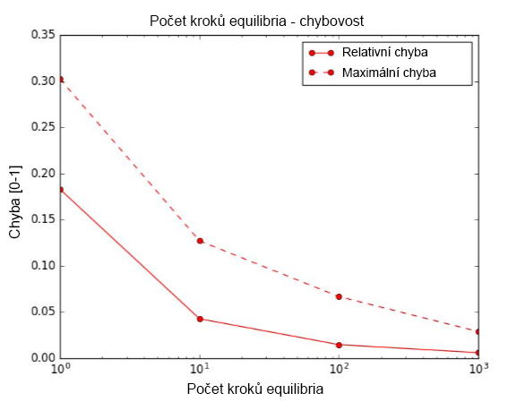
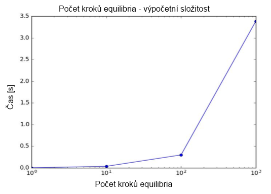

# KnapsackSwift - 4th report

- Knapsack problem solver written in Swift 4.0
- MI-PAA semestral project @ CTU FIT university
- Below is the report for the 4th part (in Czech language)
- All measurements was made on MacBook Pro (13-inch Mid 2017)   
(CPU: Intel Core i5-7360U, RAM: 16 GB, OS: macOS High Sierra)
- Author: Petr Chmelar
- Date: 19/12/2017

## Úloha
- Seznamte se s některou z pokročilých iterativních metod. 
- Metodu použijte pro řešení problému batohu a vyhodnoťte vliv parametrů na kvalitu řešení a výpočetní složitost.

## Popis řešení
- Zvolil jsem metodu simulovaného ochlazování. Metodu jsem implementoval jako extension třídy ProblemInstance z předchozích částí (soubor ProblemInstance+SimulatedAnnealing.swift).
- Metoda solveSimulatedAnnealing má celkem 4 parametry, počáteční a koncovou teplotu, počet teplotních skoků a počet kroků equilibria. Extension dále obsahuje pomocné metody.
- Pro použití parametru počtu teplotních skoků jsem se rozhodl z toho důvodu, že přímo ovlivňuje délku běhu algoritmu, což nemusí být tak výrazné u použití koeficientu ochlazování. Teplota tedy vždy lineárně klesá od počáteční ke koncové, tak aby počet skoků odpovídal hodnotě nastavené parametrem.
- V každém teplotním skoku navíc dochází k prohledávání okolí stavového prostoru aktuálního řešení (neboli ustálení materiálu v určité teplotě). Počet prohledaných stavů odpovídá hodnotě nastavené parametrem pro počet kroků equilibria. 
- Měření testuje vliv parametrů na relativní / maximální chybu a výpočetní složitost. Při testování jednoho parametru byli ostatní parametry záměrně zafixované. Měření jsem prováděl na 50 instancích problému batohu o velikosti 40 předmětů.
- Parametry jsem fixoval následovně, počáteční teplota = 0.01, koncová teplota = 0.0001, počet teplotních skoků = 100 a počet kroků equilibria = 100.

## Grafy

### Počáteční teplota
- Vyšší počáteční teplota výrazně neovlivní kvalitu řešení, ale nízká počáteční teplota výsledek zhorší. To je způsobené tím, že s nižší počáteční teplotou klesá i pravděpodobnost dostatečného globálního prohledání stavového prostoru - při nízké počáteční teplotě metoda přijme horší řešení.
- Výpočetní složitost není počáteční teplotou ovlivněna.   

### Koncová teplota
- Parametr koncové teploty se chová obdobně jako parametr počáteční teploty, pouze obráceně. Čím vyšší koncová teplota, tím vyšší je pravděpodobnost akceptace horšího řešení, protože nedojde k dostatečnému globálnímu prohledání stavového prostoru.
- Výpočetní složitost opět není ovlivněna.   

### Počet teplotních skoků
- Parametr přímo ovlivňuje počet ohodnocených stavů a čím více ohodnocených stavů, tím vyšší šance najít lepší řešení. S exponenciálně rostoucím počtem teplotních skoků tedy chybovost exponenciálně klesá.
- Z výše uvedeného logicky vyplývá, že s exponenciálně rostoucím počtem teplotních skoků roste exponenciálně i výpočetní složitost.   

### Počet kroků equilibria
- Identicky jako u parametru pro počet teplotních skoků, zde chybovost klesá exponenciálně s exponenciálně rostoucím počtem kroků equilibria. Důvodem je vyšší počet ohodnocených stavů.
- Stejně tak i výpočetní složitost roste exponenciálně s exponenciálně rostoucím počtem kroků equilibria.   

## Závěr
- Výsledky měření ukazují, že výpočetní složitost ovlivňuje pouze počet teplotních skoků a počet kroků equilibria. Oba parametry ale zároveň ovlivňují i chybovost. Při nastavení jejich hodnot je tedy třeba zvolit vhodný kompromis.
- U počáteční / koncové teploty je nutné dávat pozor na příliš nízké / vysoké hodnoty, které mohou způsobit nedostatečné globální prohledání stavového prostoru a tedy i vyšší chybovost.
